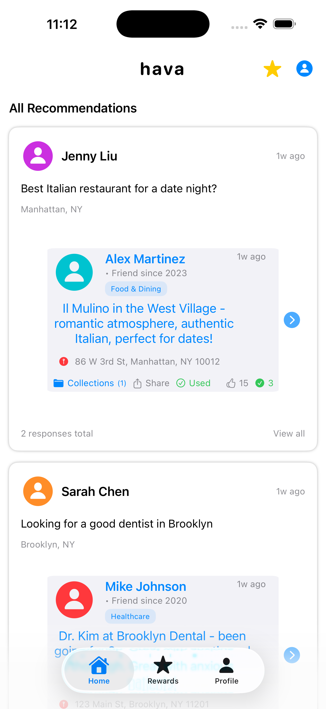
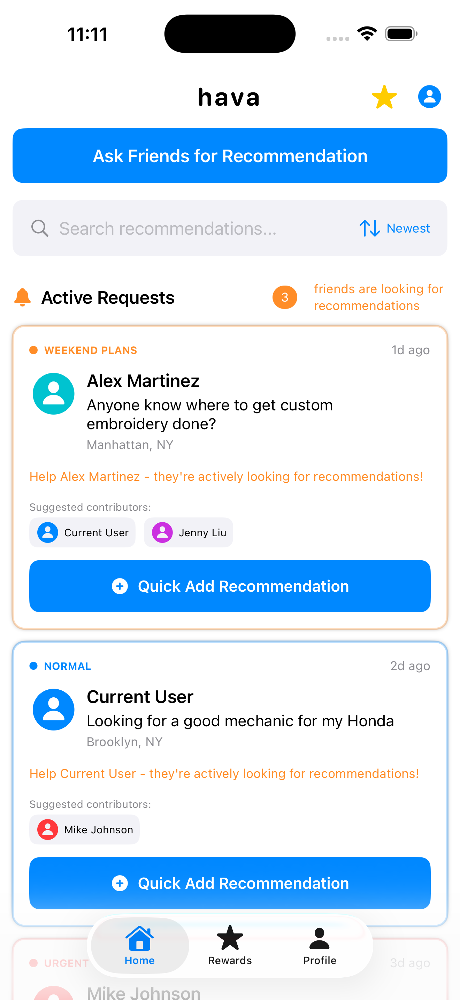
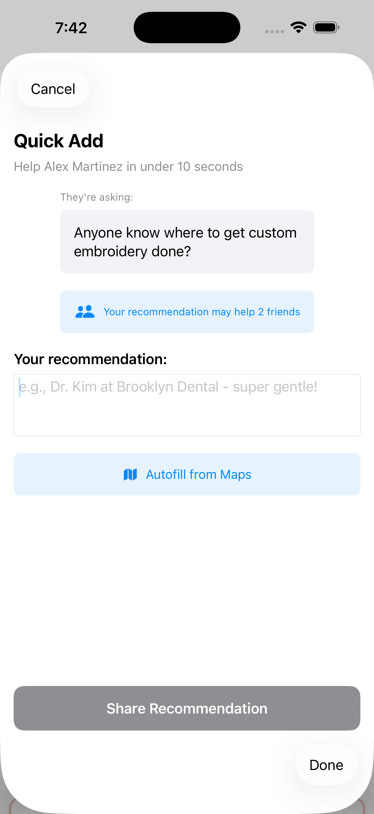
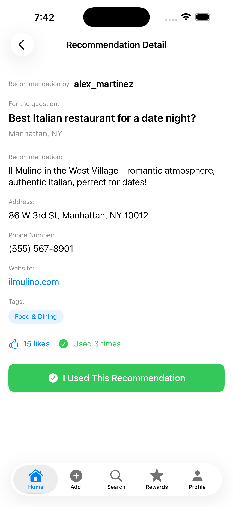
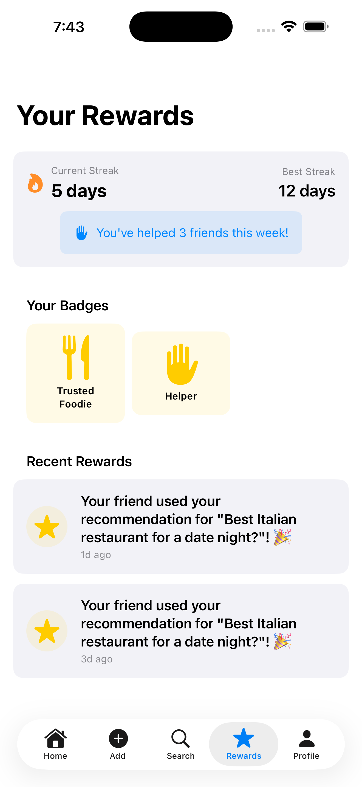
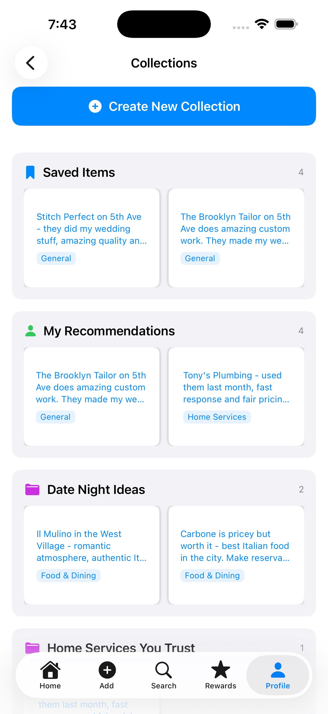
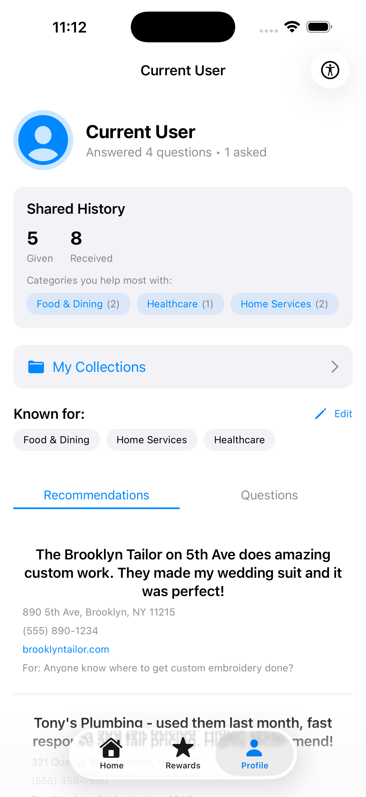
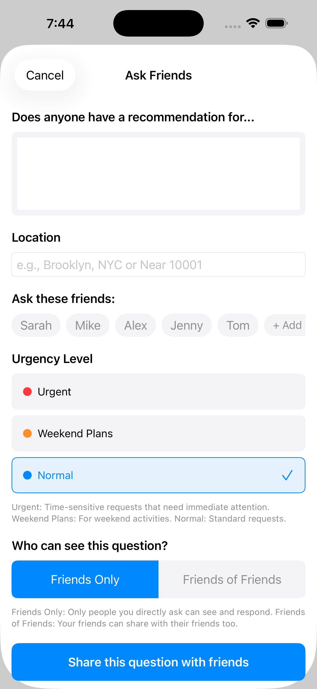

# Hava iOS App

A friend-to-friend recommendation app that makes it easy to ask for and share trusted recommendations from people you know. Built with SwiftUI to help you discover the best places and services through personal connections.

  

## Table of Contents

* [Introduction](#introduction)
* [Key Features](#features)
* [Technologies](#technologies)
* [Setup Instructions](#setup-instructions)
* [Screenshots](#screenshots)
* [Current Status](#current-status)

## Introduction

Hava is a social recommendation platform that focuses on personal connections and trusted advice from friends. Unlike generic review platforms, Hava emphasizes social reciprocity and makes helping friends feel meaningful and rewarding.

## Key Features

|  |  |
|:----------------------------------------------------:|:----------------------------------------------:|
| **Active Requests**: Highlighted requests from friends needing help | **Quick Add**: Share recommendations in under 10 seconds |

### Core Functionality
- **Home Feed**: Browse active requests and recommendations from friends
- **Ask Questions**: Request recommendations from specific friends or all friends
- **Quick Add**: Share recommendations in seconds with minimal required fields
- **Full Recommendations**: Add detailed recommendations with address, phone, website, and tags
- **Recommendation Cards**: Scrollable cards with user info, tags, engagement stats, and action buttons
- **Collections**: Save recommendations and organize them into custom collections
- **Search & Filter**: Find recommendations by keyword, location, category, or urgency

### Social & Rewards
- **Rewards System**: Get notified when friends use your recommendations
- **Streaks & Badges**: Track your daily helping streak and earn achievements
- **Social Reciprocity**: Visual indicators encourage helping friends in need

### Smart Organization
- **Auto-Tagging**: Automatic categorization (Food & Dining, Healthcare, Home Services, Auto, Beauty & Wellness, Fitness, Travel, Education, Legal)
- **Collections**: Organize saved recommendations into custom collections
- **Sort Options**: Sort by newest, most relevant, in your area, or by urgency

### Accessibility
- **High Contrast Mode**: Enhanced visibility for users with visual impairments
- **Dynamic Font Sizing**: Adjustable font size from 80% to 150%

## Technologies

- **Swift**: Modern iOS development language
- **SwiftUI**: Declarative UI framework
- **UserNotifications**: Local notification system
- **UserDefaults**: Local data persistence
- **MapKit**: Location and mapping features

## Setup Instructions

### Requirements

- Xcode 14.0 or later
- iOS 15.0+ device or simulator
- macOS (for Xcode)

### Installation

1. Download this repository

2. Open `hava-app.xcodeproj` in Xcode

3. Select your target device or simulator

4. Build and run (⌘R)

5. The app will load with sample data for demonstration

### Sample Data

The app includes sample data featuring:
- Multiple users with different expertise areas
- Active and non-active requests
- Recommendations with various categories
- Collections and badges
- User streaks and rewards

## Screenshots

|  |  |  |
|:---:|:---:|:---:|
| **Home Feed** | **Active Requests** | **Quick Add** |

|  |  |  |
|:---:|:---:|:---:|
| **Recommendation Detail** | **Rewards** | **Collections** |

|  |  |
|:---:|:---:|
| **Profile** | **Ask Question** |

## Current Status

**Version 1.0.0** - Initial Release

A fully functional iOS app built with SwiftUI using local storage (UserDefaults) for data persistence. Includes comprehensive sample data for demonstration.

✅ **Fully Functional**: Ask/answer questions, Quick Add, collections, rewards, streaks, badges, search, filtering, and accessibility features.

⚠️ **Local Only**: Data persists locally. No cloud sync, backend server, or user authentication. Ready for local use and demonstration.

## License

This project is for demonstration purposes. All rights reserved.
